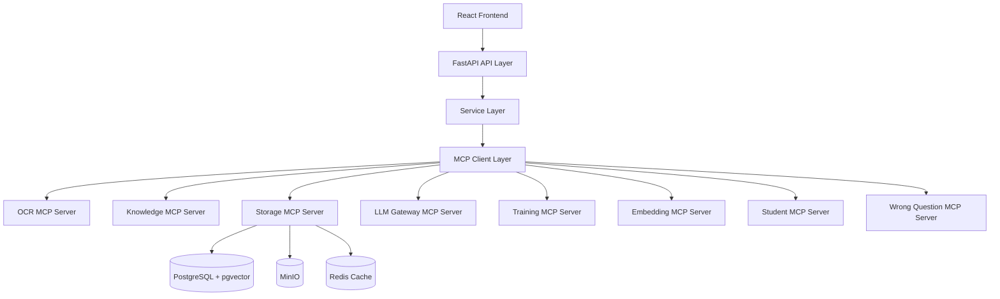

# AI Tutor Personal Edition

# System Architecture Design (SAD)

# Version 3.2 — 模型路由与工具表对齐版 (2026-07-18)

---

# CHANGE LOG

v3.1.1 → v3.2 (2026-07-18)

* §4.2 工具数 36 → 37（补录 LLM Gateway `generate`，与 MIS v1.7 §3 对齐）
* §5.2/§5.3 Provider 与路由表更新为现状（DeepSeek Pro / MIMO V2.5 / Qwen 3.6 Plus 主 VL / Ollama fallback；移除 DeepSeek R1 旧述）
* §7.1 文档处理流修正：PP-StructureV3 为 submit/poll 异步 API（同步 /layout-parsing 尚不可用）；主策略为文本块+正则切分，Whole-PDF VL 降为低产回退
* §2.1 新增 DDD 限界上下文（自 CLAUDE.md 迁入，CLAUDE.md 已重构为规则-only）

v3.0 → v3.1.1

* MCP Server 工具声明全面代码审计修正（8 Server, 36 Tools）
* 新增 Wrong Question MCP Server、Embedding MCP Server、Student MCP Server
* Storage MCP 工具修正（`save_wrong_question`/`get_wrong_questions` 归属 Wrong Question Server）
* LLM Gateway MCP 新增 Phase 2 工具（`evaluate_difficulty_v2`、`generate_thinking_hint`、`extract_visual_structure`）
* Agent 架构声明修正：TutorAgent/KnowledgeAgent 为概念角色，非独立运行时类
* 文档处理流更新为实际 Route A 并行管线（详见 [PIPELINE.md](PIPELINE.md)）
* 前端入口页面名称修正

v1.0 → v2.0

* Removed legacy Agent→Service→Repository ambiguity
* Introduced MCP-first architecture as core execution principle
* Aligned with MIS V1.1 tool definitions
* Removed Qdrant references (fully replaced by pgvector)
* Introduced LLM Gateway as mandatory control plane
* Unified Agent model (TutorAgent + KnowledgeAgent only)
* Clarified separation between SAD (architecture) and TDD (implementation)

---

# 1. System Design Principles

## 1.1 Core Philosophy

This system is designed under the following immutable principles:

### P1 — MCP First Architecture

All system capabilities MUST be exposed via MCP tools.

No direct LLM / DB / OCR access is allowed from Agents or Services.

---

### P2 — Gateway Controlled Intelligence

All LLM interactions MUST pass through:

```text id="sad_p2_flow"
LLM Gateway → Provider Routing → DeepSeek / MIMO
```

---

### P3 — Data First Principle

* Data = system foundation
* Knowledge = structured mapping
* No ephemeral reasoning storage

---

### P4 — Strict Layer Isolation

Each layer has single responsibility:

* Agent: orchestration only
* MCP: capability execution
* Service: business logic
* Repository: data access

---

# 2. High-Level Architecture



## 2.1 DDD 限界上下文

```text id="sad_ddd_contexts"
backend/app/domains/
├── document/        # PDF 上传、PP-StructureV3 解析、VL 协同、异步管线
├── embedding/       # pgvector 嵌入、相似搜索
├── knowledge/       # 知识树、知识点分类、题目→知识点映射
├── question/        # 题目模型、结构化器、跨页合并、详解
├── student/         # 学生交互（提问、提示、解答、SSE 流式）
├── system/          # 系统配置、LLM 成本审计
├── training/        # 训练生成（错题重练、模拟考）
├── wrong_question/  # 错题本、错题标记检测
└── admin/           # 批量上传、目录、统计（仅 services，无 models/repository）
```

---

# 3. Agent Architecture

## 3.1 Agent 实现状态 (2026-07-12 审计)

> **重要修正**: TutorAgent 和 KnowledgeAgent 目前是**概念性架构角色**。实际代码中不存在独立的 Agent 运行时类。Agent 职责分散在 MCP Server（`student_server.py`、`llm_server.py`、`knowledge_server.py`）和 Service 层中直接实现。未来如需实现独立的 Agent 运行时，应遵循以下架构约束。

## 3.1.1 TutorAgent（概念角色）

### Responsibility

* Student interaction
* Question solving orchestration
* Hint generation
* Streaming explanations

### Flow

```text id="sad_tutor_flow"
User → Student MCP / LLM Gateway MCP → LLM Gateway → Response Stream
```

**当前实现**: 逻辑分散在 `student_server.py`（`ask_question`、`get_hint`、`get_solution`）、`llm_server.py`（`solve_question`、`generate_thinking_hint`）、`sse_handler.py`（流式响应）

---

## 3.1.2 KnowledgeAgent（概念角色）

### Responsibility

* Knowledge mapping
* Difficulty analysis
* Similar question retrieval
* Learning path inference

### Flow

```text id="sad_knowledge_flow"
Question → Knowledge MCP → KnowledgeMapper Service → pgvector → Mapping
```

**当前实现**: 逻辑在 `knowledge_server.py` + `KnowledgeMapper` Service（三阶段：关键词匹配 → 题型启发式 → LLM fallback）

---

## 3.2 Forbidden Agents

* OCR Agent ❌
* Storage Agent ❌
* Solver Agent ❌

All replaced by MCP tools.

---

# 4. MCP Architecture Layer

## 4.1 MCP is the ONLY execution layer

Agents cannot execute logic directly.

They must call MCP tools.

---

## 4.2 MCP Servers（代码审计验证 — 2026-07-12；2026-07-18 更新至 37 工具）

共 8 个 MCP Server，37 个工具（逐工具权威表：MIS.md v1.7 §3）：

### OCR MCP (`ocr_server.py`)

* `extract_document` — 文档解析与 OCR
* `split_questions` — 文本分割为独立题目
* `extract_formula` — 公式提取
* `detect_wrong_mark` — 错题标记检测（图像分析）

---

### Knowledge MCP (`knowledge_server.py`)

* `classify_subject` — 学科识别
* `classify_knowledge_points` — 知识点分类
* `evaluate_difficulty` — 难度评估 (1-5)
* `map_question_to_knowledge` — 题目→知识树节点映射
* `identify_subject` — 规则优先学科识别 + LLM fallback (Phase 2)

---

### Storage MCP (`storage_server.py`)

* `save_question` — 持久化题目
* `get_question` — 按 ID 获取题目
* `search_questions` — 文本/过滤搜索
* `save_solution` — 持久化解答（禁止 COT）
* `get_stored_solution` — 按题目 ID 获取解答

> **注意**: `save_wrong_question` 和 `get_wrong_questions` 属于 **Wrong Question MCP Server**，不是 Storage MCP。

---

### LLM Gateway MCP (`llm_server.py`)

* `solve_question` — 生成完整教学解答
* `review_solution` — 评估解答质量
* `generate_explanation` — 生成详细解释
* `compare_solutions` — 比较两个解答
* `evaluate_difficulty_v2` — 难度评估 v2（支持文本+图像）(Phase 2)
* `generate_thinking_hint` — 生成苏格拉底式思考提示（不揭示答案）(Phase 2)
* `extract_visual_structure` — 从题目图像提取结构化信息 (Phase 2)
* `generate` — 通用文本生成（无任务模板的直连 Gateway 生成入口）

---

### Training MCP (`training_server.py`)

* `generate_training_set` — 生成专题练习
* `generate_wrong_question_training` — 从错题生成训练
* `generate_mock_exam` — 生成模拟考试

---

### Embedding MCP (`embedding_server.py`)

* `generate_embedding` — 生成题目向量嵌入
* `search_similar` — pgvector 余弦相似度搜索
* `embedding_health` — 嵌入服务健康检查

---

### Student MCP (`student_server.py`)

* `ask_question` — 提交问题（文本/图像）
* `get_hint` — 生成思考提示
* `get_solution` — 生成解答步骤
* `choose_mode` — 记录学习模式选择 (think/explain)
* `update_question_text` — 更新 student_question 文本

---

### Wrong Question MCP (`wrong_question_server.py`)

* `save_wrong_question` — 保存错题记录
* `get_wrong_questions` — 列出错题
* `get_pending_status` — 检查待处理检测任务
* `get_queue_status` — 获取队列状态

---

## 4.3 MCP Execution Rule

```text id="sad_mcp_rule"
Agent → MCP Client → MCP Server → Service → Infra
```

---

# 5. LLM Gateway Architecture

## 5.1 Role

LLM Gateway is the ONLY access point to LLM providers.

## 5.2 Providers

* DeepSeek Pro（reasoning / 详解生成）
* MIMO V2.5 / V2.5 Pro（fast / vision）
* Qwen 3.6 Plus（VL primary — 布局理解 / OCR 验证，`VL_PRIMARY=qwen`）
* Ollama qwen2.5vl:3b（local VL fallback，last-resort）

## 5.3 Routing Strategy

| 任务类型 | Provider |
| -------- | -------- |
| 文档解析 | PP-StructureV3（百度星河 API，独立于 Gateway，见 PIPELINE.md） |
| 布局理解 / OCR 验证 | Qwen 3.6 Plus |
| 图像 / 图表二次分析 | MIMO V2.5 |
| 推理 / 详解生成 | DeepSeek Pro |
| 可视化解析 | MIMO V2.5 Pro |
| 快速回答 | MIMO V2.5 |
| 本地回退 | Ollama qwen2.5vl:3b |

**回退链**: primary → cloud → Ollama（三级）。运行时 mode 定义以 `gateway/router.py` 为准。

## 5.4 Responsibilities

* Prompt management
* Token tracking
* Cost control
* Fallback routing

---

# 6. Data Architecture

## 6.1 Storage Stack

* PostgreSQL (core relational data)
* pgvector (semantic search only)
* MinIO (file storage)
* Redis (cache/session)

## 6.2 Data Flow

```text id="sad_dataflow"
PDF → MinIO → PP-StructureV3 /layout-parsing → MIMO V2.5 + Qwen 3.6 Plus 协同
  → QuestionStructurer → 跨页合并 → KnowledgeMapper → PostgreSQL + pgvector
  → 详解生成 → 智能分析 → 辅导输出
```

## 6.3 Strict Rule

> NO reasoning, prompt, or COT data is stored.

Only:

* Questions
* Answers
* Knowledge mappings
* Wrong records
* Metadata

---

# 7. System Workflow Architecture

## 7.1 Document Processing Flow（PP-StructureV3 单引擎）

```text id="sad_flow_doc"
1. PDF Upload → MinIO 存储
2. PP-StructureV3 submit/poll 异步 API（POST /api/v2/ocr/jobs → 轮询 → JSONL 下载；同步 /layout-parsing 尚不可用）
3. 提取分支（由 LLM_ANNOTATION_ENABLED 控制）:
   ├─ 主策略: PP-StructureV3 文本块 + 正则切分 + classify_pending_types LLM 补类
   │    → QuestionStructurer.structure()
   │    → structure_from_pdf_whole() 低产回退（Whole-PDF VL → MIMO）
   │    → _merge_cross_page_questions() 跨页合并
   └─ LLM 标注 (Session #91): 一次 LLM 调用标注完整 Markdown → JSON
        → _step_llm_annotate() 调用 MIMO fast mode
        → _save_annotated_questions() 直接入库（绕过正则管线）
4. KnowledgeMapper（关键词 → 题型启发式 → LLM fallback）
5. 详解生成（DeepSeek Pro + MIMO V2.5 Pro, 针对缺失详解的题目）
6. 智能分析（错题本 → 薄弱点识别 → 推荐策略）
7. 辅导输出（错题重练 + 知识点讲解 + 进度跟踪）
```

> **废弃组件**: PyMuPDF (C1)、本地 PaddleOCR (C2)、qwen2.5vl:3b C3a 均已废弃。
> PP-StructureV3 是唯一文档解析引擎。详见 [PIPELINE.md](PIPELINE.md)。

## 7.2 Solution Flow

```text id="sad_flow_sol"
Question
  → Student MCP / LLM Gateway MCP
  → LLM Gateway
  → Solution generated
  → Storage MCP
  → DB
```

## 7.3 Wrong Question Flow

```text id="sad_flow_wrong"
Image
  → detect_wrong_mark (OCR MCP)
  → Question extraction
  → Wrong Question MCP: save_wrong_question
  → Similarity search via Embedding MCP (pgvector)
```

---

# 8. Knowledge System Architecture

## 8.1 Knowledge Model

Predefined hierarchical tree — 9 subjects, 4-level depth:

* Mathematics（数学）
* Physics（物理）
* Chemistry（化学）
* Biology（生物）
* Chinese（语文）
* English（英语）
* Politics（政治）
* History（历史）
* Geography（地理）

Each contains:

* Topics
* Subtopics
* Leaf nodes

**实现文件**: `app/domains/knowledge/tree_seed/` — 11 个文件，共 2232 行

## 8.2 Rule

> Knowledge nodes are STATIC.

AI cannot generate new nodes.

## 8.3 Mapping Flow

```text id="sad_knowledge_map"
Question → KnowledgeMapper（三阶段）
  1. 关键词匹配（~60% 覆盖）
  2. 题型启发式
  3. LLM fallback → Node ID
```

---

# 9. API Layer Positioning (ACS Alignment)

SAD strictly defines:

* API Layer = thin orchestration only
* No business logic allowed
* No LLM calls allowed
* No DB access allowed

---

# 10. System Boundaries

## Allowed

* MCP calls
* Service orchestration
* Stateless computation

## Forbidden

* Direct DB access from Agents
* Direct LLM calls from API
* Cross-MCP internal calls
* Dynamic schema creation

---

# 11. Performance Architecture Targets

| Layer         | Latency Target |
| ------------- | -------------- |
| OCR MCP       | < 3s           |
| Knowledge MCP | < 800ms        |
| Storage MCP   | < 500ms        |
| LLM Gateway   | < 8s           |

---

# 12. Failure Handling Strategy

## 12.1 MCP Failure

* retry 2 times
* fallback provider if LLM failure

## 12.2 LLM Failure

* switch provider
* degrade to hint mode

## 12.3 OCR Failure

* fallback to PaddleOCR + VL hybrid

---

# 13. Observability Model

Each request MUST include:

* request_id
* trace_id
* latency
* tool usage
* cost estimate

---

# 14. Architecture Governance Rules

## Rule 1

SAD defines structure, not implementation.

## Rule 2

If conflict exists:

```text id="sad_rule2"
TASK.md > MIS.md > ACS.md > SAD.md
```

## Rule 3

SAD cannot override execution contracts.

## Rule 4

All new features must be MCP-first.

---

# 15. Architecture Freeze Statement

This architecture is considered stable.

Any modification must satisfy:

* MCP compatibility
* No new agent introduction
* No bypass of LLM Gateway
* No direct DB access changes

---

# SAD V3.1 — 代码审计修正版 (2026-07-12)

---

# 16. Phase 2 Architecture Extension

## 16.1 Student Frontend Architecture

Phase 2 introduces student-facing entry point:

```text
/           → Student Frontend (AskPage, WrongBookPage)
/admin      → Admin Backend (QuestionTreePage, QuestionEditPage, BatchUploadPage, StatisticsPage, DocumentsPage, SettingsPage)
```

> **修正**: 代码中不存在 `StudentDashboard.tsx`、`AdminDashboard.tsx`、`WrongQuestionDashboard.tsx`。实际前端页面为以上名称。

Both entry points share the same backend services.

---

## 16.2 Dual-Task Parallel Architecture

Student ask flow triggers two parallel tasks:

```text
Student Submit Question
    │
    ├──→ Task A (Immediate): Vision LLM → Difficulty → Thinking Hint → Choice → Solution
    │
    └──→ Task B (Async): Image Enhance → OCR → Visual Extraction → Storage → Classification → Embedding
```

Task A is blocking (student waits for response).
Task B is non-blocking (async background processing).

---

## 16.3 Failure Recovery Architecture

```text
Vision LLM Success → Normal Flow
Vision LLM Failure → OCR Fallback → Text LLM
OCR Failure → Prompt Re-upload
All Failure → User-friendly Error + Log
```

---

## 16.4 LLM Gateway Vision Extension

LLM Gateway now supports multimodal models:

| Task Type | Model Type | Provider |
|-----------|------------|----------|
| Text Solution | Text Model | DeepSeek / MIMO |
| Image Solution | Vision Model | DeepSeek-VL / Qwen-VL |
| Thinking Hint | Text Model | DeepSeek |
| Visual Extraction | Vision Model | DeepSeek-VL / Qwen-VL |

Same API KEY can invoke different model types.

---

## 16.5 New MCP Tools (Phase 2) — 全部已实现

### LLM Gateway MCP (Extended)

* `evaluate_difficulty_v2` ✅ — 难度评估 v2（支持图像输入）
* `generate_thinking_hint` ✅ — 苏格拉底式思考提示
* `extract_visual_structure` ✅ — 图像结构化信息提取

### Student MCP (New)

* `ask_question` ✅
* `get_hint` ✅
* `get_solution` ✅
* `choose_mode` ✅
* `update_question_text` ✅

### Knowledge MCP (Extended)

* `identify_subject` ✅ — 规则优先学科识别 + LLM fallback

---

## 16.6 Structured Visual Extraction

Vision model outputs structured JSON:

```json
{
  "question_text": "...",
  "diagram_elements": [],
  "relationships": [],
  "subject": "...",
  "knowledge_points": []
}
```

Supports: geometry, circuits, chemistry apparatus.
